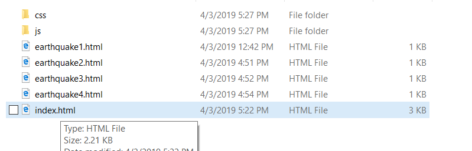
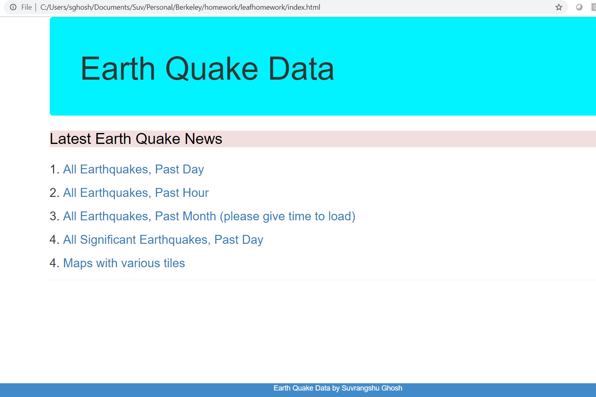
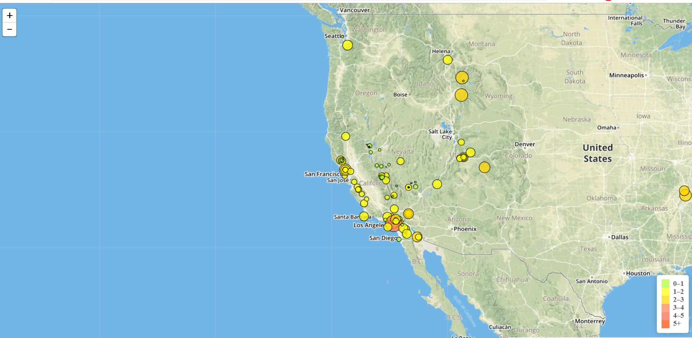
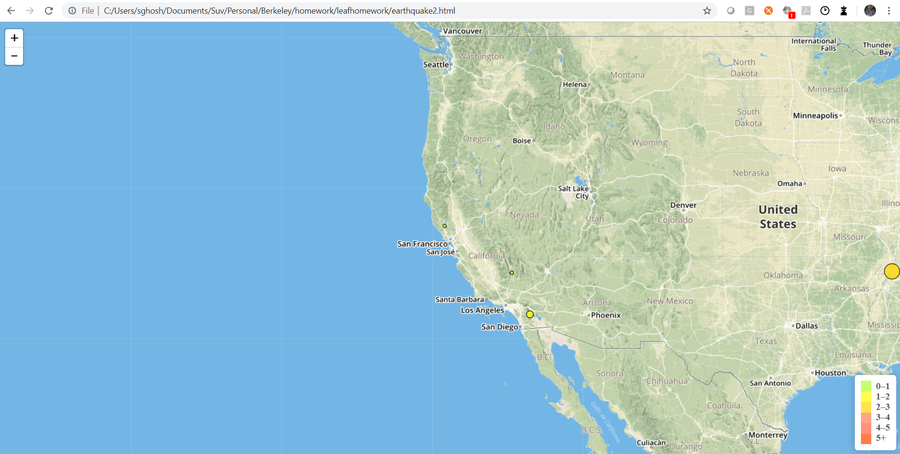
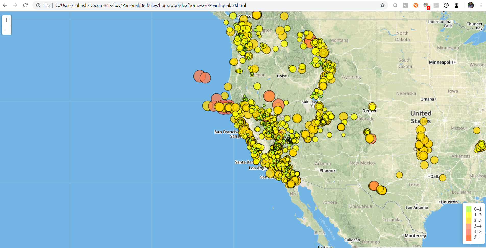
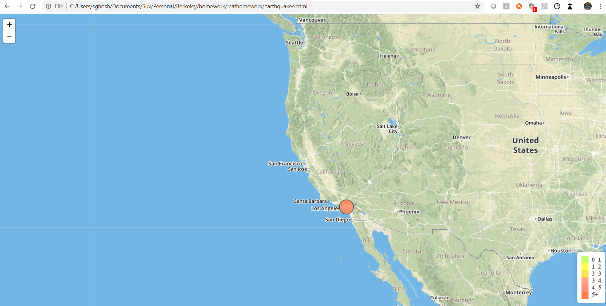
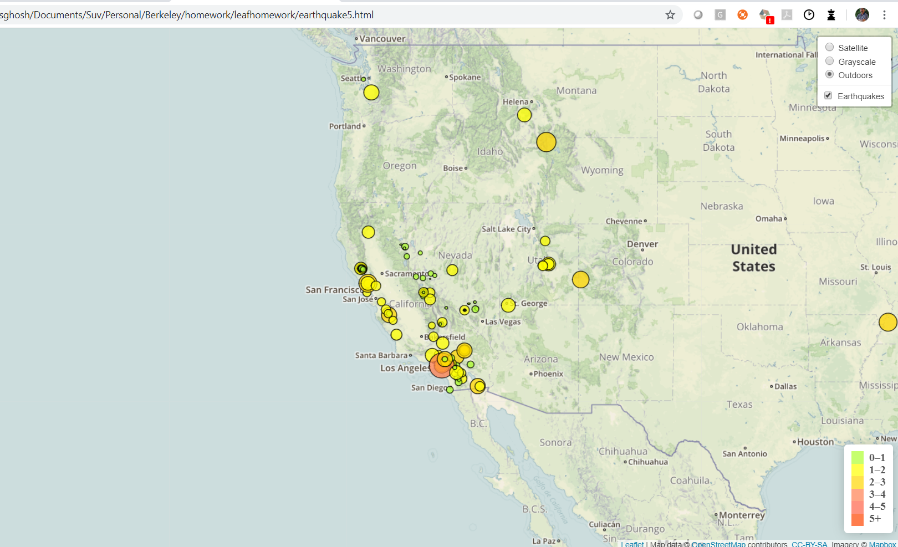
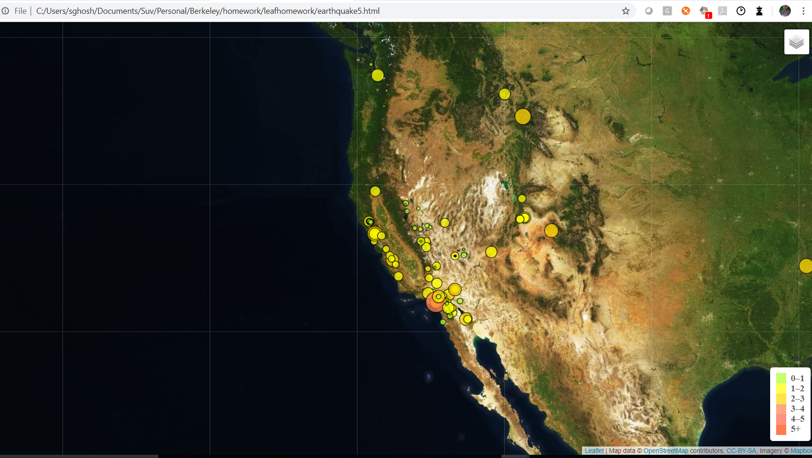
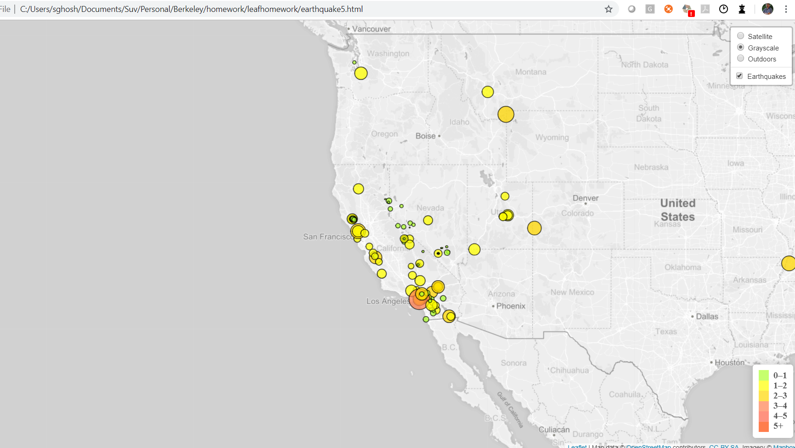

# Unit 17 | Assignment - Visualizing Data with Leaflet

## Suvrangshu Ghosh

<u>Creating website maps using Leaflet.</u>

**Instructions:**

Please execute index.html in web.

You will get a Landing page, showing reports on earthquakes.
Like this :

Please click on each options to view the different earthquakes maps areas:

1. 

2. 

3. 

4. 

5.

6.

7.

